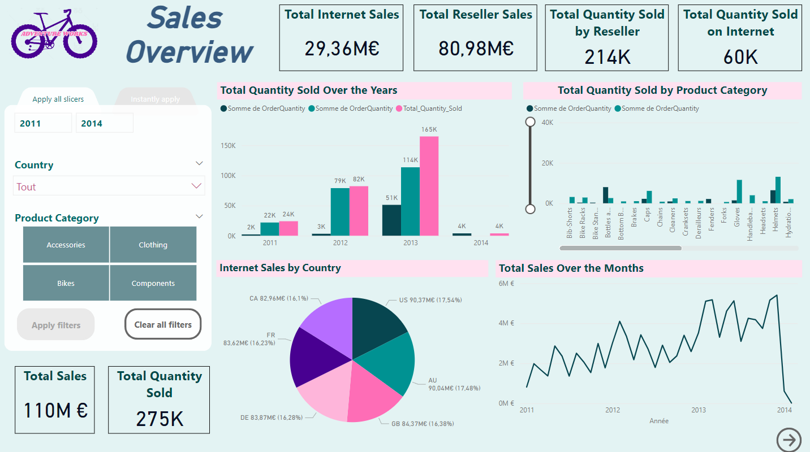
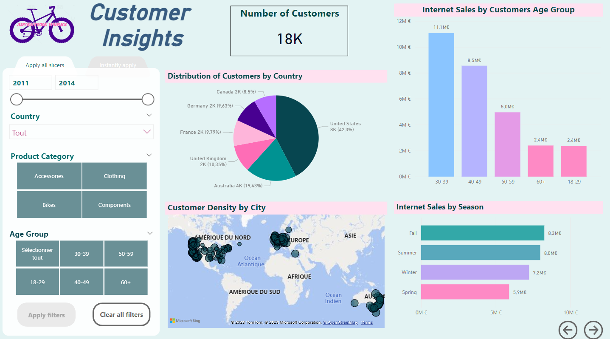

## Dashboard

 Dans cette partie, nous allons explorer comment obtenir des données depuis notre instance de conteneur SQL Server à l'aide de Power BI. Le tableau de bord final comprendra cinq pages, chacune fournissant des informations essentielles pour une prise de décision éclairée.

### Obtention des Données avec Power BI

1. Ouvrez Power BI Desktop et choisissez l'option "Get Data" pour importer des données.

2. Sélectionnez "SQL Server" comme source de données et fournissez les informations de connexion à votre instance de conteneur SQL Server déployée sur Azure.

3. Choisissez la base de données appropriée (AdventureWorks2019DW) et sélectionnez les tables nécessaires pour votre tableau de bord.

4. Appliquez les transformations et les filtres nécessaires pour préparer vos données pour la visualisation.

### Pages du Tableau de Bord

Le tableau de bord final comprendra cinq pages, chacune fournissant des informations uniques :

1. **Sales Overview** : Cette page offre un aperçu des ventes globales, des tendances de vente au fil du temps et des performances commerciales clés.

2. **Customer Insights** : Explorez les informations sur les clients, tels que les préférences d'achat et les segments de clients (tranches d'âge, pays).

Pages à ajouter : 

3. **Product Insight** : Obtenez des informations sur les produits, y compris les produits les plus vendus, les catégories populaires et l'évolution de la popularité des produits.

4. **Employee Performance** : Suivez les performances des employés et identifiez les employés les plus performants.

5. **Geographical Analysis** : Visualisez les données géographiques pour comprendre les ventes par région, les marchés les plus performants et les opportunités de croissance.

