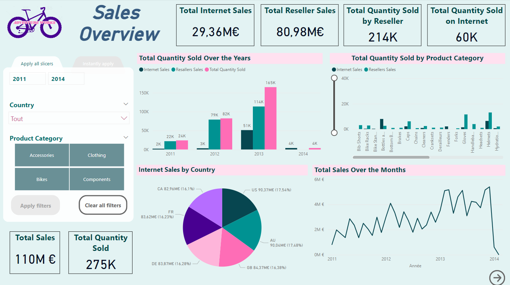
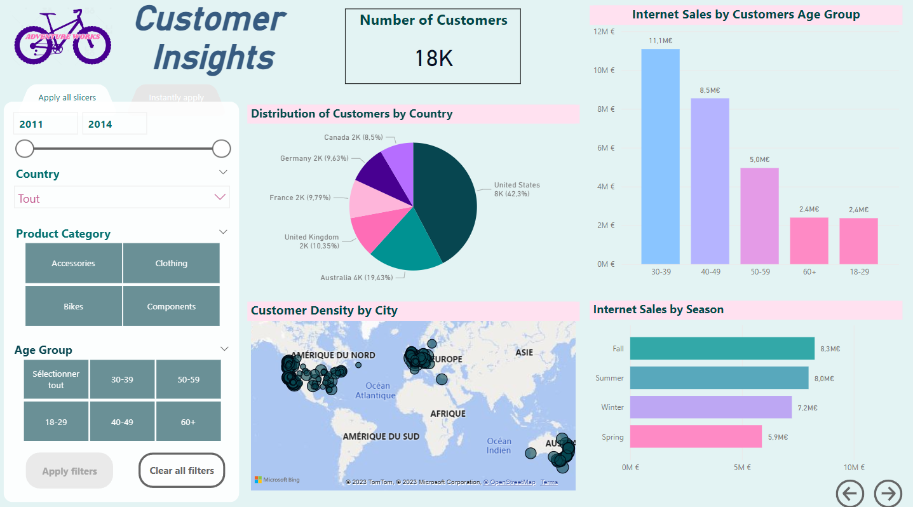

# AdventureWorks_SQL_PowerBI

## Contexte du Projet
La direction d'Adventure Works est engagée dans une initiative d'optimisation des opérations commerciales et d'amélioration des ventes. Dans le cadre de ce projet, nous avons hérité d'une base solide posée par l'équipe data d'Adventure Works, mais suite à leur départ soudain, le projet est resté inachevé. Notre mission est de reprendre le travail effectué, le finaliser et fournir des solutions pour des décisions éclairées.

## Objectifs
Ce projet a pour objectif principal de se familiariser avec plusieurs aspects clés du domaine de la gestion des données et de l'analyse, en mettant l'accent sur les compétences suivantes :
- Apprentissage de SQL pour interroger efficacement les bases de données.
- Compréhension du processus de restauration d'une base de données.
- Utilisation de Power BI pour créer un tableau de bord interactif.
- Déploiement de la base de données sur Azure.

## Structure du projet
Le projet est divisé en quatre grandes parties, chacune ayant un objectif spécifique. 

### Partie 1 : Récupération et Gestion des Données
Dans cette partie, notre objectif est de reconstituer les bases de données à partir des fichiers de sauvegarde fournis et de comprendre la structure des données.

- *veille.md* : Ce fichier contient des informations sur les concepts clés tels que OLTP, OLAP, DataWarehouse, DataLake, DataMart et DataMesh.

- *restoration.md* : Ce fichier explique étape par étape comment restaurer les bases de données à partir des fichiers de sauvegarde AdventureWorks2019.bak et AdventureWorksDW2019.bak.

- *schema_erd.png* : Ce fichier est une image représentant le schéma Entité-Relationnel (ERD) de la base de données.

- *Dockerfile* : Dockerfile pour construire le conteneur docker avec l'image sql server.

- *build_and_run.sh* : Script pour construire et lancer le conteneur docker.

### Partie 2 : Requêtes SQL pour l'OLTP
Dans cette partie, nous mettrons en pratique nos compétences en SQL pour résoudre diverses problématiques. 
Les consignes et solutions sont disponibles à cette adresse : 
https://www.w3resource.com/sql-exercises/adventureworks/adventureworks-exercises.php

- *QueryAdventureWorksSQL.sql*: Ce fichier contient les 50 premières requêtes SQL pour résoudre les problématiques identifiées.

### Partie 3 : Déploiement sur Azure
Dans cette partie, est expliqué comment deployer notre conteneur Docker sur Azure.

-*deployment.md* : Ce fichier explique comment créer une image Docker de votre conteneur et comment le déployer sur Azure.

### Partie 4 : Création d'un Tableau de Bord
Dans cette dernière partie, nous créerons un tableau de bord interactif pour l'équipe de direction, utilisant des outils tels que Power BI.

- *adventure_works_dashboard.pbix* : Ce fichier est un tableau de bord interactif créé à l'aide de Power BI pour répondre aux questions de suivi d'activité de l'entreprise.

